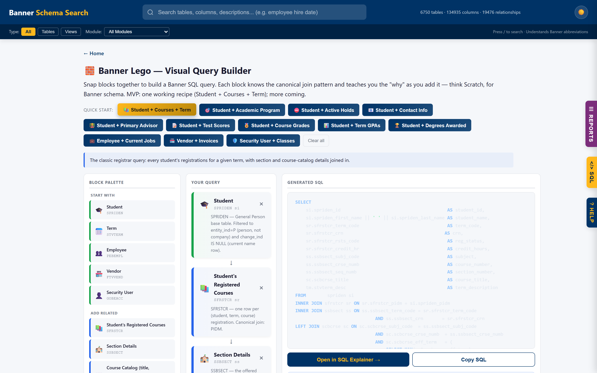

# Banner Schema Search

A smart, self-contained **search · query-builder · audit** tool for Ellucian Banner. Search 6,900+ tables and 133,000+ columns instantly, build Banner SQL by snapping visual blocks together, run 14 ready-made security audits, and validate any SQL against the live schema — **no AI, no server, no internet required**, just open one HTML file in any browser.

> "How does it work so well without AI?" — It uses the same algorithms that powered Google and Elasticsearch for decades. Pure math, zero magic.



*Banner Lego — snap blocks together to build Banner SQL. Each block teaches you the canonical join pattern (PIDM, TERM_CODE+CRN, effective-dated MAX() subquery) while the SQL generates live.*

---

## What's Inside

This is one HTML file with six distinct tools glued together:

| Tool | What it does | How to reach it |
|---|---|---|
| **🔎 Schema Search** | Type English, find Banner tables/columns. BM25 + synonym expansion + trigram fuzzy matching. Instant results across 133K+ columns. | `/` or start typing |
| **🧱 Banner Lego** | Visual query builder. Snap source/join/filter blocks, see the SQL generate live, learn why each join is structured the way it is. 12 pre-built recipes covering Student, HR, Finance, Security. | `#/builder` · Dashboard card · `banner lego` |
| **🛡️ Security Posture Scorecard** | Paste one-row output of SR014 into a textarea — 8 traffic-light gauges light up: dormant accounts, terminated-with-access, super users, PII breadth, violations, unused classes, etc. Everything client-side, persists in localStorage. | `#/scorecard` · `security posture` |
| **💡 Ask Banner** | Natural-language → generated SQL. Ask "finance security classes", "access to SHAINST", "users in class SFAREGS", "Student user access inventory" — get Argos-ready SQL with step-by-step explanation. | Just type a question |
| **☰ Ready-to-run Reports** | 14 vetted SR0XX reports: dormant accounts, terminated-with-access, direct-grant bypass, PII audit, violation dashboard, module overview, per-module user-form inventory, security posture scorecard. | `#/reports` · `~` |
| **🔧 SQL Explainer** | Paste any Banner SQL. Validates every table/column against the embedded schema, runs 15+ Banner pitfall checks, matches against a curated case library, shows "Did you mean…?" suggestions. Live syntax highlighting. | `#/sql` |

Plus: dark/light theme toggle (sun/moon button — cycles Auto → Light → Dark — also `Ctrl+Shift+L`), command palette (`Ctrl+Shift+F`), Help panel with 50+ clickable example queries.

---

## Quick Start (3 steps)

```bash
# 1. Install the only dependency
pip install jinja2

# 2. Build the site (takes ~3 seconds)
python build.py

# 3. Open in your browser
#    Windows:
start docs\index.html
#    Mac/Linux:
open docs/index.html
```

That's it. You now have a fully searchable Banner data dictionary + query builder + security audit tool.

---

## 🧱 Banner Lego — The Visual Query Builder

**Think Scratch for Banner SQL.** New users building their first Banner report typically hit the same walls: *"is the enrollment table SFRSTCR or SFRSTCA?"*, *"what's the canonical join to SCBCRSE?"*, *"why do I need MAX(effective_date)?"*. Banner Lego solves this by turning the query into visual blocks where each block carries its own canonical join pattern and a plain-English "why" tooltip.

Three block kinds, color-coded:

- **🟢 Source (green)** — the `FROM` table. Seven sources: Student (SPRIDEN), Employee (PEBEMPL), Vendor (FTVVEND), Security User (GOBEACC), Term (STVTERM), etc.
- **🔵 Join (blue)** — add a related table with its canonical join. 20+ joins: registered courses, section details, course catalog (with the `MAX(eff_term)` effective-dated pattern), primary advisor (with double-SPRIDEN trick), mailing address, preferred email, current jobs, invoices, security classes, etc.
- **🟡 Filter (yellow)** — constrain the result. By term, active registrations only, by subject, approved invoices, active employees, aid year, graduation term, etc.

### 12 pre-built recipes (one-click load)

**Student module:**
- 📚 Student + Courses + Term (the classic registrar query)
- 🎯 Student + Academic Program (major/college/degree via SGBSTDN)
- ⛔ Student + Active Holds (SPRHOLD with date-window filter)
- 📧 Student + Contact Info (preferred email + primary phone + mailing address, all with correct status filters)
- 🧑‍🏫 Student + Primary Advisor (with double-SPRIDEN for advisor name)
- 📝 Student + Test Scores (SORTEST — ACT/SAT/TOEFL/placement)
- 🎖️ Student + Course Grades (SHRTCKN + SHRTCKG joined by `tckn_seq_no`)
- 📊 Student + Term GPAs (SHRGPAC — GPA + hours attempted/earned per term)
- 🏆 Student + Degrees Awarded (SHRDGMR filtered to `DEGS_CODE = 'AW'`)

**HR / Finance / Security:**
- 💼 Employee + Current Jobs (PEBEMPL + NBRJOBS with MAX(effective_date) pattern + NBBPOSN for title)
- 🏪 Vendor + Invoices (FTVVEND + SPRIDEN for name + FABINVH approved only)
- 🛡️ Security User + Classes (GOBEACC + GURACLS with canonical audit pattern + GTVCLAS for class description)

### Schema-validated at build time

Every column referenced in every block is verified against the real schema (`field_info.txt`) during `python build.py`. Exit code 2 if any block references a phantom column — **no more invented columns ship to production**.

```
[5/6] Validating Banner Lego catalog columns...
       Loaded schema: 6,750 tables, 134,567 columns
       Lego validator: 34 blocks scanned
       [OK] All referenced columns exist in the schema
```

When the SQL is ready, one click sends it to the **SQL Explainer** for pitfall checks before you paste it into Argos.

---

## 🛡️ Security Posture Scorecard

**SR014 → 8 traffic-light gauges in one view.** The scorecard is a one-row SELECT (runs in ~2-5 seconds at a typical site) whose output you paste into a textarea in the app. The dashboard paints itself with gauges for every major audit risk:

| Metric | Green if ≤ | Watch if ≤ | Source report |
|---|---|---|---|
| 💤 Dormant Accounts | 0 | 20 | SR001 |
| 🚨 Terminated w/ Access | 0 | 5 | SR002 |
| ⚡ Super Users | 5 | 15 | SR008 |
| 🛡️ Direct-Grant Bypass | 10 | 30 | SR004 |
| 🔒 PII Broad Access | 10 | 30 | SR011 |
| 📛 Violations (30d) | 50 | 200 | SR005 |
| 🗑️ Unused Classes | 10 | 30 | SR006 |
| 🏚️ Legacy GURUCLS | 0 | 5,000 | SR003 |

Everything runs **client-side**. Pasted values persist in `localStorage` — a new tab still shows your last scorecard. Click any gauge to jump to the full report.

---

## 💡 Ask Banner — Natural Language → SQL

Type a question in plain English. The tool recognizes 8 intent patterns and generates SQL inline with step-by-step explanation:

```
"finance security classes"            → GTVCLAS query scoped to sysi_code = 'F'
"Student user access inventory"       → SR012 SQL scoped to Student module
"access to SHAINST"                   → who can access this form (class + direct + group)
"users in class SFAREGS"              → class membership with audit_time pattern
"list banner modules"                 → SR013 + a pretty 8-card module grid
"security posture scorecard"          → jumps to the scorecard view
"banner lego" / "query builder"       → jumps to the visual builder
"dormant accounts" / "terminated…"    → opens the matching SR0XX directly
```

Every intent answer includes:
- The generated SQL with **syntax highlighting**
- An **Explanation** block explaining each clause in plain English
- **Caveats** — Banner-specific gotchas (LISTAGG overflow, role-suffix edge cases, GUBOBJS schema location, etc.)
- **"Validate in SQL Explainer →"** button — one click runs the built-in pitfall checker

---

## 14 Ready-to-Run Security Reports

Every report is vetted SQL with header metadata (category, severity, tables, description, when-to-use, caveats):

| ID | Title | Category | Severity |
|---|---|---|---|
| SR001 | Dormant Banner Accounts | Access Review | MEDIUM |
| SR002 | Terminated Employees with Active Access | Access Review | **HIGH** |
| SR003 | Class Membership Report (canonical) | Access Review | INFO |
| SR004 | Direct Object Grants — Bypassing CLASS | Privilege Escalation | **HIGH** |
| SR005 | Security Violation Dashboard (30d) | Monitoring | INFO |
| SR006 | Unused Security Classes (cleanup) | Access Review | INFO |
| SR007 | Most Populated Classes | Access Review | MEDIUM |
| SR008 | Super Users — Top _M Grant Holders | Privilege Escalation | **HIGH** |
| SR009 | Recent Access Changes (30d audit trail) | Monitoring | INFO |
| SR010 | Object Access Concentration | Inventory | MEDIUM |
| SR011 | PII / Sensitive Data Access Audit | Privilege Escalation | **HIGH** |
| SR012 | Banner User Access Inventory — Finance | Inventory | INFO |
| SR013 | Banner Module Access Overview | Inventory | INFO |
| SR014 | Security Posture Scorecard feed | Monitoring | INFO |

All use canonical Banner patterns: `GURACLS` with `MAX(audit_time)` + `audit_action <> 'D'`, `LISTAGG ... ON OVERFLOW TRUNCATE` for long lists, `GOBEACC` in `GENERAL` schema, role-suffix decoding with edge-case handling for custom roles (`BAN_DEFAULT_NO_ACCESS` etc.).

---

## 🔧 SQL Explainer & Validator

Paste any Banner SQL and the tool inspects it against the live schema and a curated knowledge base of real Banner integration cases.

- **Schema validation** — Every table and column referenced is checked against the embedded Banner schema. Unknown identifiers flagged with "Did you mean…?" suggestions (Levenshtein distance).
- **Banner pitfall detection** — Catches real-world gotchas:
  - `PHRHIST` used without `PHRHIST_DISP >= '60'` filter (in-progress vs posted)
  - Payroll tables without a `PICT_CODE` filter
  - `SPRIDEN` without `CHANGE_IND IS NULL` (current vs historical)
  - `SPRADDR` with student address types instead of HR-specific
  - `PEBEMPL_CURRENT_HIRE_DATE` vs `PEBEMPL_FIRST_HIRE_DATE` for tax reporting
  - `PHRHIST_GROSS > 0` filter that excludes negative reversal records
  - `PERETOT` for SUI/unemployment without student-employment exclusion
  - Security-aware rules: GURACLS without audit pattern, role-suffix traps, direct-grant bypass detection, GOBEACC schema mismatches
- **Function-aware parser** — Correctly handles `EXTRACT(MONTH FROM col)`, `TRIM(LEADING ' ' FROM col)`, `SUBSTRING(col FROM n FOR m)` — no false-positive table references.
- **Business-case matching** — Compares your query's tables against `data/business_cases.txt` (W-2 reporting, SURS exemptions, payroll adjustments, Federal/Medicare/SS tax) and `data/security_cases.txt` (12 security-specific cases) and surfaces matching scenarios with lessons learned.
- **Live syntax highlighting** — As you type.
- **All offline** — Everything runs in the browser. Your SQL never leaves your machine.

---

## How Does It Work Without AI?

This is the question everyone asks. The answer: **the same techniques that powered search engines for 30 years before LLMs existed.**

### BM25 Ranking (core algorithm)

BM25 (Best Matching 25) is from the 1990s and is still the default in Elasticsearch, Apache Lucene, and Apache Solr.

```
score(Document, Query) = Σ for each query term of:
    IDF(term) · (tf · (k1 + 1)) / (tf + k1 · (1 - b + b · docLength / avgDocLength))
```

- **IDF** = how rare a word is. "PIDM" is rare and important; "the" is common and worthless.
- **tf** = how many times the word appears in this document.
- **k1=1.5, b=0.75** = standard tuning parameters.

A document scores high when it contains rare, important words from your query, especially if those words appear frequently relative to document length.

### Banner Synonym Expansion (the secret sauce)

Banner names are like `PEBEMPL_ECLS_CODE`. Humans search for "employee class code". A hand-curated synonym map bridges the gap:

```python
'employee': ['empl', 'emp', 'pebempl']
'address':  ['addr', 'spraddr', 'street', 'city', 'state', 'zip']
'salary':   ['wage', 'pay', 'compensation', 'earnings']
```

When you search "employee hire date", the engine tokenizes, expands with synonyms at 40% weight, and BM25-ranks the combined set.

### Fuzzy Matching (typo tolerance)

Trigram similarity — the same technique used by PostgreSQL's `pg_trgm`. `employy` still finds `employee` via character-level overlap.

### Build-Time Indexing (why it's fast)

All the heavy computation happens once during `python build.py`:

```
table_info.txt + field_info.txt
    |
    v
[Python: Parse → Tokenize → Stem → Calculate BM25 → Build Inverted Index]
    |
    v
[Lego catalog validator — verifies every block's column refs vs schema]
    |
    v
index.html (data + index + 12 Lego recipes + 14 reports embedded as JSON)
    |
    v
[Browser: hash lookups + simple math → instant results]
```

---

## Project Structure

```
BannerSemanticSearch/
├── build.py                              # Main build (6 steps: parse → categorize → index →
│                                         #   relationships → validate Lego catalog → generate)
├── requirements.txt                      # jinja2 only
├── src/
│   ├── parser.py                         # Reads table_info.txt, field_info.txt
│   ├── categorizer.py                    # Maps prefixes to 14 Banner modules (incl. Security)
│   ├── indexer.py                        # BM25 + synonym map + trigram index
│   ├── relationships.py                  # FK parsing + inferred relationships
│   └── generator.py                      # Jinja2 rendering + report/case loading
├── scripts/
│   ├── convert_darkmode.py               # One-shot transformer: @media dark → html.dark class
│   └── validate_lego_catalog.py          # Build-time gate: verifies every Lego block's columns
├── templates/
│   └── index.html                        # The SPA (HTML + CSS + JS in one file, ~6K lines)
├── data/                                 # Input (pipe-delimited)
│   ├── table_info.txt                    #   TABLE|TYPE|DESCRIPTION
│   ├── field_info.txt                    #   TABLE|COLUMN|DESCRIPTION
│   ├── relationships.txt                 #   FK constraints (optional)
│   ├── business_cases.txt                #   33 payroll/tax/integration cases
│   ├── security_cases.txt                #   12 security-specific cases
│   └── reports/                          #   14 SR*.sql files with header metadata
│       ├── SR001_dormant_accounts.sql
│       ├── …
│       └── SR014_security_posture_scorecard.sql
└── docs/                                 # Generated output
    ├── index.html                        # THE OUTPUT — open this in any browser (~20 MB)
    └── img/
        └── banner-lego.png               # Screenshot for README
```

---

## Data Extraction Guide

The tool needs 3 data files from your Banner Oracle database.

### Prerequisites

- Access to Banner's Oracle database (SQL Developer, TOAD, SQL*Plus, or any Oracle client)
- SELECT privileges on schemas: `SATURN`, `PAYROLL`, `POSNCTL`, `BANINST1`, `GENERAL`, `FIMSMGR`

### File 1: `table_info.txt`

```sql
SELECT trim(TABLE_NAME) || '|' || TABLE_TYPE || '|' ||
       trim(NVL(COMMENTS, '(no comments)'))
FROM   all_tab_comments
WHERE  OWNER IN ('SATURN','PAYROLL','POSNCTL','BANINST1','GENERAL','FIMSMGR')
ORDER BY TABLE_NAME;
```

### File 2: `field_info.txt`

```sql
SELECT trim(c.TABLE_NAME) || '|' ||
       c.COLUMN_NAME || '|' ||
       trim(NVL(c.COMMENTS, '(no comments)'))
FROM   ALL_COL_COMMENTS c
WHERE  c.OWNER IN ('SATURN','PAYROLL','POSNCTL','BANINST1','GENERAL','FIMSMGR')
ORDER BY c.TABLE_NAME, c.COLUMN_NAME;
```

Largest file (~11 MB, 130K+ rows). Takes 10-30 seconds to extract.

### File 3: `relationships.txt` *(optional)*

```sql
SELECT cc.TABLE_NAME || '|' || cc.COLUMN_NAME || '|' ||
       rc.TABLE_NAME || '|' || rc.COLUMN_NAME || '|' ||
       c.CONSTRAINT_NAME
FROM   all_constraints c
JOIN   all_cons_columns cc ON cc.CONSTRAINT_NAME = c.CONSTRAINT_NAME AND cc.OWNER = c.OWNER
JOIN   all_cons_columns rc ON rc.CONSTRAINT_NAME = c.R_CONSTRAINT_NAME
                          AND rc.OWNER = c.R_OWNER
                          AND rc.POSITION = cc.POSITION
WHERE  c.CONSTRAINT_TYPE = 'R'
       AND c.OWNER IN ('SATURN','PAYROLL','POSNCTL','BANINST1','GENERAL','FIMSMGR')
ORDER BY cc.TABLE_NAME, cc.COLUMN_NAME;
```

Without this file, the tool still infers ~10,000 relationships from naming conventions. With it, you get ~15,000.

### SQL*Plus spooling

```sql
SET LINESIZE 2000 PAGESIZE 0 FEEDBACK OFF HEADING OFF TRIMSPOOL ON LONG 4000
SPOOL table_info.txt
-- (paste query here)
SPOOL OFF
```

**SQL Developer:** Run → right-click → Export → Format: Text, Delimiter: `|` → Save.

Place all files in `data/`, then run `python build.py`.

---

## Sharing with Your Team

| Option | How |
|---|---|
| **Send the file** | Mail `docs/index.html` to anyone. They open in any browser. Done. |
| **GitHub Pages** | Push the repo, enable Pages on `/docs`. Share the URL. ~4 MB gzipped. |
| **Shared drive** | Copy `docs/index.html` anywhere. No installation for users. |
| **Run from source** | `git clone` → `pip install jinja2` → `python build.py` → open |

---

## Contributing

Adding a new Banner Lego block or recipe? The build-time validator has your back:

```bash
python build.py
# …
[5/6] Validating Banner Lego catalog columns...
       [FAIL] sd.shrdgmr_phantasm — SHRDGMR.SHRDGMR_PHANTASM not found
       [ERROR] Banner Lego catalog has invalid column references.
```

Add your block to `templates/index.html` in the `BLOCK_CATALOG` literal and/or a new recipe in `BUILDER_RECIPES`. The validator will catch phantom columns before the build completes.

Adding a new security report? Drop a `.sql` file in `data/reports/` with the required header comments (`REPORT_ID`, `TITLE`, `CATEGORY`, `TABLES`, `SEVERITY`, `DESCRIPTION`, `WHEN_TO_USE`, `CAVEATS`). The build will pick it up and wire it into the reports index, command palette, and Ask Banner's `P4` shortcut mechanism.

---

## FAQ

**Q: How big is the output file?**
~20 MB (schema data, search index, all 14 reports, Lego catalog, Scorecard, etc.). Opens instantly in any modern browser. On GitHub Pages with gzip, ~4 MB.

**Q: Does it need internet?**
No. Everything is in one HTML file. Open it from desktop, USB, network drive, anywhere.

**Q: Does it use AI or machine learning?**
No. Zero AI. BM25 + synonym expansion + trigram matching + hand-curated case libraries.

**Q: What Python version?**
Python 3.8+. Only dependency: `jinja2`.

**Q: Can I add my own synonyms?**
Yes. Edit `src/indexer.py`, add entries to `BANNER_SYNONYMS`, rebuild. At search time, use the interactive term builder to add session-only terms.

**Q: What Banner versions does this support?**
Any version. Reads generic Oracle metadata (`ALL_TAB_COMMENTS`, `ALL_COL_COMMENTS`). Works with Banner 8, Banner 9, and anything in between.

**Q: My site has a custom `sysi_code` not in the canonical list (F/S/P/A/R/T/G/N).**
Fine — `SR013` / `list banner modules` lists whatever codes actually exist in your `GURAOBJ`. The 8-card reference grid in Ask Banner shows the canonical Ellucian codes as guidance, but the SQL reports real data.

**Q: Does the Scorecard call my database?**
No — the Scorecard is 100% client-side. You run `SR014` in your own Oracle tool, paste the one-row result into a textarea, and gauges populate via JavaScript. Nothing leaves your browser.

---

## License

MIT. Share freely. If your institution finds this useful, we'd love to hear about it — open an issue or send a pull request.
